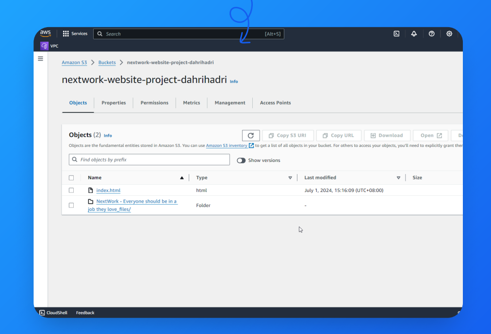

# AWS S3 Static Website
Step-by-step guide how I host a static website on Amazon S3, including setup instructions, code examples, and resource management tips. Perfect for beginners looking to explore AWS services and deploy their first website

## Documentation

You can download the project documentation as a PDF from [here](docs/documentation-of-Host-a-website-on-amazon-s3.pdf).

# AWS S3 Static Website Hosting

This project demonstrates how to host a static website on Amazon S3. I'll create an S3 bucket, upload my website files, and configure the bucket to serve my site publicly on the internet.


## Introducing Amazon S3!

### What it does & how it’s useful

- Amazon S3 is a scalable object storage service for storing and retrieving any amount of data from anywhere.
Developers and teams use Amazon S3 because of its durability, scalability, and cost-effectiveness. It supports various data formats and integrates seamlessly with other AWS services.

### How I’m using it in today’s project

- I'm using Amazon S3 in this project to host a static website

### This project took me... 

- This project took me approximately 15 minutes to complete. Documentation took me around 15 minutes, ensuring clear and comprehensive guidelines for future reference and ease of use.

- **Difficulty**: Easy
- **Time**: 30 min
- **Cost**: $0 (within the AWS Free Tier)

## Table of Contents

- [Prerequisites](#prerequisites)
- [Steps](#steps)
  - [Step 1: Create an S3 Bucket](#step-1-create-an-s3-bucket)
  - [Step 2: Upload Website Content](#step-2-upload-website-content)
  - [Step 3: Configure Static Website Hosting](#step-3-configure-static-website-hosting)
  - [Step 4: Make Your Website Public](#step-4-make-your-website-public)
  - [Step 5: Delete Resources](#step-5-delete-resources)
- [License](#license)

## Prerequisites

- An [AWS account](https://aws.amazon.com/free/) (Free Tier eligible)
- Basic knowledge of HTML

## Steps

### Step 1 Create an S3 bucket

Creating an Amazon S3 bucket took me 5 mins...
- Some of the configuration steps include:
  - The bucket’s Region: I pick the region closest to my primary user base or where my other AWS resources are located to minimize latency and data transfer costs.
  - Access Control Lists: Enable
  - Bucket versioning: Enable
  - Public Access: Enable
 
S3 bucket names have to be globally unique, which means that each bucket name must be distinct across all AWS accounts and regions. No two buckets can have the same name anywhere in the world.

My created bucket!


### Step 2: Upload Website Content

- Next, I uploaded my website’s files into my S3 bucket.
- There were two files to upload: [index.html](aws-s3-static-website/assets/index.html) and Nextwork. -Everyone should have a job where they love_files, you can find additional resources and assets [here](https://github.com/dahrihadri/aws-s3-static-website/tree/main/assets). index.html references and utilizes files from the website_files directory to render properly. For example, Images and other resources in website_files are used to enrich content on the webpage.

Object successfully uploaded



### Step 3: Configure Static Website Hosting

- Website hosting is a service that allows organizations or individuals to post a web page on the internet.
- To enable website hosting, I clicked on the properties tab on my s3 bucket and then scrolled down to “static website hosting” then clicked “Enabled”
- Once the static website is enabled, S3 produces a bucket endpoint URL http://nextwork-website-project-dahrihadri.s3-website-us-west-2.amazonaws.com/

Setting up static website hosting...


### Step 4: Make Your Website Public

#### An error!

- When I visited the bucket endpoint URL, an error message appeared.
- The reason for this error was due to the actual HTML/image files that I've uploaded are still private. It's kind of like having a bucket on display, so everyone can see the bucket - but the contents are covered up, preventing anyone from seeing what's inside.


- To solve this error, I need to set the permission of the objects to the public by enabling the object ACLs.
  
Voila! My website was up and running after resolving those errors


### Step 5: Delete Resources

Make sure you delete all your resources to avoid getting charged. This is a super important task for every single project you set up.


## Terraform Script

I have provided a Terraform script to automate the setup of your S3 static website. Use the following script:

```hcl
# main.tf

provider "aws" {
  region = "us-west-2"
}

resource "aws_s3_bucket" "website_bucket" {
  bucket = "nextwork-website-project-dahrihadri"
  acl    = "public-read"
  force_destroy = true

  website {
    index_document = "index.html"
  }

  versioning {
    enabled = true
  }

  lifecycle {
    prevent_destroy = false
  }
}

resource "aws_s3_bucket_object" "website_files" {
  bucket = aws_s3_bucket.website_bucket.bucket
  key    = "index.html"
  source = "assets/index.html"
  acl    = "public-read"
}

resource "aws_s3_bucket_object" "website_assets" {
  bucket = aws_s3_bucket.website_bucket.bucket
  key    = "website_files/"
  source = "assets/NextWork - Everyone should be in a job they love_files/"
  acl    = "public-read"
}
```
- Replace `nextwork-website-project-dahrihadri` with your desired unique bucket name.
- Update the source paths to point to your local files.
- This project is licensed under the MIT License. See the [License](#license) file for more information. Feel free to adjust the details based on your specific needs or any additional information you want to include.


