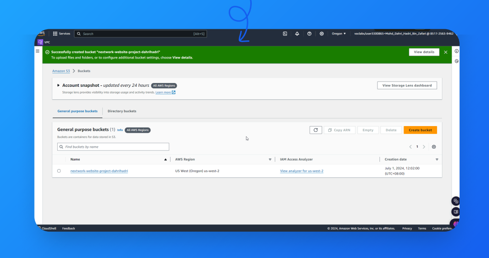

# aws-s3-static-website
Step-by-step guide to hosting a static website on Amazon S3, including setup instructions, code examples, and resource management tips. Perfect for beginners looking to explore AWS services and deploy their first website
# AWS S3 Static Website Hosting

This project demonstrates how to host a static website on Amazon S3. You'll create an S3 bucket, upload your website files, and configure the bucket to serve your site publicly on the internet.


## Project Overview

- **Difficulty**: Easy
- **Time**: 45 min
- **Cost**: $0 (within the AWS Free Tier)

## Table of Contents

- [Prerequisites](#prerequisites)
- [Steps](#steps)
  - [Step 1: Create an S3 Bucket](#step-1-create-an-s3-bucket)
  - [Step 2: Upload Website Content](#step-2-upload-website-content)
  - [Step 3: Configure Static Website Hosting](#step-3-configure-static-website-hosting)
  - [Step 4: Make Your Website Public](#step-4-make-your-website-public)
  - [Step 5: Delete Resources](#step-5-delete-resources)
- [License](#license)

## Prerequisites

- An [AWS account](https://aws.amazon.com/free/) (Free Tier eligible)
- Basic knowledge of HTML

## Steps

### Step 1: Create an S3 Bucket

In the AWS Management Console, search for S3 and create a new bucket.



### Step 2: Upload Website Content

Upload your `index.html` file and any associated images to the S3 bucket.


### Step 3: Configure Static Website Hosting

Configure your S3 bucket for static website hosting by setting the index document and making sure your content is public.


### Step 4: Make Your Website Public

Use ACLs to make your website files publicly accessible.

### Step 5: Delete Resources

Once you're done, make sure to delete your resources to avoid any unwanted charges. You can use the script provided in the `scripts/` directory.

```bash
bash scripts/delete-resources.sh
